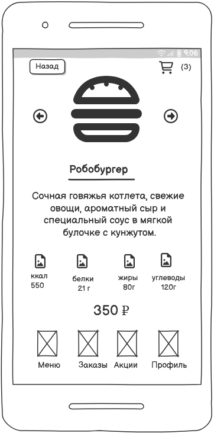

# 10	Пользовательский интерфейс приложения
## 10.1.	Прототипы интерфейсов
Пользовательский интерфейс представлен в виде вайрфоеймов страниц веб-приложения

## 10.1.1.	Главная страница 

# 10.1.2 Инфорация о продукте

## 10.1.3 Тип заказа

## 10.1.4 Проверка заказа

## 10.1.5 Оплата

## 10.1.6 Подтверждение заказа

## 10.1.7 Ошибка при заказе 

...
## 10.2.	Прототип приложения

[Интерактивный PDF](wf/prototype_new.pdf)
