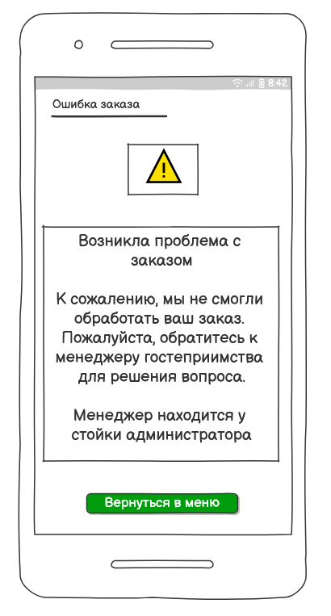

# 10	Пользовательский интерфейс приложения
## 10.1.	Прототипы интерфейсов
Пользовательский интерфейс представлен в виде вайрфоеймов страниц веб-приложения

## 10.1.1.	Главная страница

## 10.1.2 Тип заказа

## 10.1.3 Проверка заказа

## 10.1.4 Оплата

## 10.1.5 Подтверждение заказа

## 10.1.6 Ошибка при заказе 

...
## 10.2.	Прототип приложения

[Интерактивный PDF](wf/prototype.pdf)
