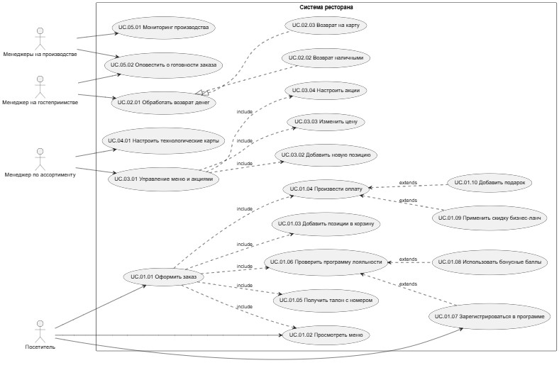
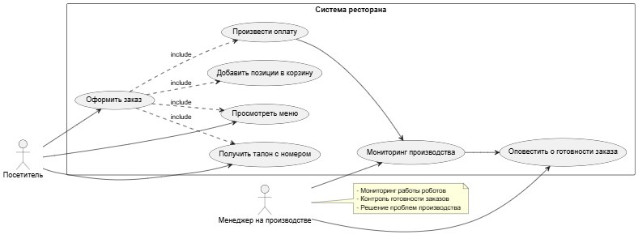
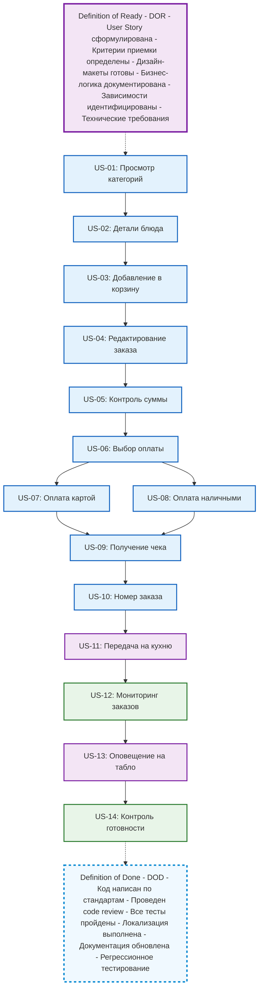

# 6 Требования к системе

## 6.1 Требования к системе в целом

## 6.1.1 Функциональные требования

*   FT1 Организация рабочего места администратора для настройки взаимодействия с роботами.
*   FT2 Создание отдельных АРМ для производственной части и технолога.
*   FT3 Реализация ролевой модели: Пользователь, Оператор (технолог), Кладовщик.
*   FT4 Вывод на монитор информации об окончании продукта или срока годности у роботов.
*   FT5 Возможность формирования заказов нестандартной конфигурации (добавление/удаление ингредиентов).
*   FT6 Реализация личного кабинета пользователя.
*   FT7 Обеспечение взаимодействия между кассой и роботами.
*   FT8 Подключение роботов к системе приема заказов.
*   FT9 Интеграция с системами: складской учет, мониторинг, бухучет.
*   FT10 Ежечасный сбор информации об остатках продукции на складе.
*   FT11 Обеспечение базового логирования работы системы.
  
## 6.1.2 Нефункциональные требования

### Производительность

NFPER1 Система должна обрабатывать не менее 99% стандартных заказов (до 5 позиций) за время не более 2 минут с момента получения системой подтверждения об успешной оплате заказа до момента размещения собранного заказа в зоне выдачи.

NFPER2 Система должна обеспечивать доступность готового заказа для выдачи клиенту в течение 5 минут с момента готовности в 99% случаев, после чего заказ автоматически списывается.

NFPER3 Система должна выдерживать пиковые нагрузки в 320 заказов в час.

NFPER4 Система должны обеспечить выполнение 2000 заказов в сутки. 

### Безопасность

NFSEC1 Система должна предусматривать аутентификацию пользователей в системе по номеру телефона и паролю. 

NFSEC2 Пользователи должны обязательно аутентифицироваться для использования бонусов. 

NFSEC3 Система должна позволять пользователям просматривать только свои заказы, размещенные ими лично, но не другими пользователями.

NFSEC4 Данные оплаты не должны храниться внутри системы

NFSEC5 Сервисы должны логировать конфиденциальные данные в замаскированном виде

### Масштабируемость

NFSCA1 Система роботизированного ресторана должна масштабироваться минимум на 10 ресторанов.

### Надежность

NFREL1 Система должна обеспечивать коэффициент доступности не менее 99% в течение года.

NFREL2 Время восстановления после сбоя не более одного часа (РТО)

NFREL3 Время потери данных за время, не более 1 часа (РПО).

### Совместимость

Система должна быть совместима с ОС Windows 10/11, Android 10+ и iOS 14+.

### Доступность

NFAVA1 Допустимое время простоя в сутки не более 60 минут.

NFAVA2 Система должна обеспечивать коэффициент доступности не менее 99% в течение года.

### Удобство использования

NFUSA1 Интерфейс системы должен поддерживать переключение между русским и английским языками.

NFUSA2 Информация о блюдах (состав, цена, время приготовления) должна быть представлена явно и доступно.

### Концептуальная целостность

NFCON1 Система должна соответствовать архитектурному стилю REST. 

### Поддерживаемость

NFMAI1 Доступ к базам данных уже имеющихся самописных систем (складская система, кассовая система,) должен быть через АПИ или отдельный шлюз. 

NFMAI2 Конфигурационные параметры должны быть вынесены во внешние конфигурационные файлы. 

NFMAI3 Процесс развертывания должен быть автоматизирован с использованием CI/CD-пайплайнов.

NFMAI4 Кодовая база должна иметь покрытие модульными тестами не менее 80%.

NFMAI5 Система должна обеспечивать сквозное логирование. 

## 6.2 Требования к функциям, выполняемым системой
### 6.2.1.	Use Сase диаграмма

Основные функции системы представлены в виде UseCase диаграммы. 

[{: .hover-zoom }](diagrams/usecasediagram1.jpg){: target="_blank" }

### 6.2.2 Описание UseCase, реализуемых в рамках MVP

#### 6.2.2.1 Вариант использования: UC.01.01 «Оформить заказ»

Описание варианта использования (назначение):
Посетитель ресторана может самостоятельно оформить заказ через систему, зарегистрироваться в программе лояльности и оплатить заказ.

**Предусловия**
- Система находится в рабочем режиме
- Меню актуально и доступно для заказа
- Платежная система доступна и функционирует
- Система лояльности доступна для проверки и регистрации
- Система производства готова к приему заказов

**Постусловия**
- Заказ создан и сохранен в системе в статусе "Оплачен"
- Оплата успешно проведена и подтверждена
- Заказ передан в производственную систему
- Баланс бонусных баллов обновлен (если использовались)

**Основной поток**
1. Посетитель выбирает категорию блюд в меню
2. Система отображает меню
3. Посетитель выбирает конкретное блюдо и добавляет его в корзину
4. Посетитель переходит в корзину
5. Посетитель повторяет шаги 1-2 для всех желаемых позиций
6. Система отображает полный список заказанных позиций с суммарной стоимостью
7. Система проверяет возможность применения акций и выдачи подарков
8. Система предлагает выбрать способ получения ("В зале" или "На вынос")
9. Посетитель выбирает способ получения
10. Система проверяет участие в программе лояльности
11. Посетитель подтверждает участие в программе лояльности
12. Система предлагает списать доступные бонусные баллы
13. Посетитель соглашается списать часть баллов
14. Система рассчитывает итоговую сумму с учетом бонусов
15. Посетитель выбирает способ оплаты
16. Система обрабатывает оплату
17. Система генерирует и выдает талон с номером заказа
18. Система передает заказ в производство

**Альтернативный поток А1: Регистрация в программе лояльности**
8.а. Система определяет, что посетитель не зарегистрирован в программе лояльности
    1. Система предлагает зарегистрироваться в программе лояльности
    2. Посетитель соглашается на регистрацию
    3. Система запрашивает номер телефона для регистрации
    4. Посетитель вводит номер телефона
    5. Система регистрирует посетителя и начисляет приветственные бонусные баллы
    6. Система предлагает использовать приветственные бонусы
    7. Посетитель соглашается использовать часть бонусных баллов
    8. Возврат к шагу 12 основного потока

**Альтернативный поток А2: Неактивность пользователя**
4.а. Посетитель не совершает действий в течение 2 минут после добавления товаров в корзину
    1. Система отображает предупреждение "Вы еще с нами?" с таймером
    2. Посетитель не реагирует на предупреждение в течение 2 минут
    3. Система автоматически возвращается на главный экран меню
    4. Незавершенный заказ сохраняется в черновиках на 10 минут
    5. Все выбранные позиции удаляются из корзины
    6. Use case прерывается по таймауту

**Исключения**
**EX-1: Ошибка оплаты**
- Платежная система возвращает ошибку проведения платежа
- Система предлагает выбрать другой способ оплаты или повторить попытку
- Возврат к шагу выбора способа оплаты

**EX-2: Товар недоступен**
- Выбранная позиция отсутствует в наличии
- Система уведомляет "Товар временно недоступен"
- Предложение выбрать альтернативную позицию
- Возврат к выбору позиций меню

**EX-3: Технический сбой системы**
- Система обнаруживает внутреннюю ошибку
- Отображение сообщения "Технические неполадки"
- Предложение обратиться к менеджеру
- Use case аварийно завершается

#### 6.2.2.2 **Вариант использования: UC.03.01 «Управление меню и акциями»**

**Описание варианта использования (назначение)**
Менеджер по ассортименту осуществляет управление меню ресторана: добавляет новые позиции, изменяет цены существующих товаров, настраивает акционные предложения и программу лояльности. Все изменения должны синхронизироваться с системой производства и кассами.

**Предусловия**
- Пользователь аутентифицирован в системе и имеет роль "Менеджер по ассортименту"
- Система находится в рабочем режиме
- Интеграция с системой производства стабильна
- Доступна актуальная база технологических карт

**Постусловия**
- Изменения в меню сохранены в системе
- Актуальная версия меню доступна на всех кассах и киосках
- Производственная система получила обновленные данные о позициях меню
- Все изменения записаны в журнал аудита

**Основной поток**
1. Менеджер выбирает раздел "Управление меню" в административной панели
2. Система отображает текущую структуру меню с группировкой по категориям
3. Менеджер выбирает действие "Добавить новую позицию"
4. Система отображает форму добавления позиции
5. Менеджер заполняет атрибуты позиции
6. Менеджер сохраняет новую позицию
7. Система валидирует данные и проверяет связь с технологической картой
8. Система добавляет позицию в меню
9. Менеджер выбирает действие "Настроить акцию"
10. Система отображает список активных акций
11. Менеджер создает новую акцию типа "Бизнес-ланч"
12. Система запрашивает параметры акции
13. Менеджер сохраняет настройки акции
14. Система активирует акцию и распространяет изменения на все точки продаж
15. Система отображает сообщение об успешном применении изменений

**Альтернативный поток А1: Изменение цены существующей позиции**
3.а. Менеджер выбирает существующую позицию в меню
    1. Менеджер выбирает действие "Изменить цену"
    2. Система запрашивает новую цену и причину изменения
    3. Менеджер вводит новую цену и комментарий
    4. Система применяет изменение цены
    5. Система уведомляет менеджера об успешном изменении
    6. Возврат к шагу 2 основного потока

**Альтернативный поток А2: Настройка программы лояльности**
9.а. Менеджер выбирает раздел "Программа лояльности"
    1. Система отображает текущие настройки программы лояльности
    2. Менеджер изменяет параметры:
       - Размер бонуса за регистрацию
       - Процент начисления от суммы чека
       - Правила списания бонусов
       - Срок действия бонусных баллов
    3. Менеджер сохраняет изменения
    4. Система применяет новые правила лояльности
    5. Возврат к основному потоку

**Исключения**
**EX-1: Ошибка валидации технологической карты**
- Технологическая карта имеет невалидный XML-формат
- Система отображает сообщение "Ошибка формата технологической карты"
- Предложение загрузить корректный файл
- Возврат к шагу 5 основного потока

**EX-2: Конфликт акций**
- Новая акция конфликтует с существующими акциями
- Система отображает предупреждение о конфликте
- Предложение изменить параметры акции
- Возврат к шагу 12 основного потока

**EX-3: Недостаточно прав**
- Пользователь не имеет прав для изменения меню
- Система отображает сообщение "Недостаточно прав для выполнения операции"
- Вариант использования аварийно завершается

#### 6.2.2.3 **Вариант использования: UC.04.01 «Настроить технологические карты»**

**Описание варианта использования (назначение)**
Менеджер по ассортименту настраивает и управляет технологическими картами для роботизированного производства. Карты содержат точные инструкции для роботов по приготовлению каждой позиции меню, включая последовательность операций, количество ингредиентов и время приготовления.

**Предусловия**
- Пользователь аутентифицирован в системе и имеет роль "Менеджер по ассортименту"
- Система находится в рабочем режиме
- Роботизированное оборудование подключено и доступно
- Доступен актуальный перечень полуфабрикатов и ингредиентов

**Постусловия**
- Технологическая карта сохранена в системе
- Изменения синхронизированы с роботизированным производством
- Карта доступна для использования в процессе приготовления
- Все изменения записаны в журнал аудита

**Основной поток**
1. Менеджер выбирает раздел "Технологические карты" в административной панели
2. Система отображает список существующих технологических карт с возможностью фильтрации по категориям
3. Менеджер выбирает действие "Создать новую технологическую карту"
4. Система отображает форму создания карты
5. Менеджер заполняет основные параметры
6. Менеджер добавляет этапы приготовления
7. Менеджер добавляет ингредиенты
8. Менеджер настраивает параметры контроля качества
9. Менеджер сохраняет технологическую карту
10. Система валидирует карту на соответствие формату XML
11. Система отправляет карту в производственную систему для тестирования
12. Система подтверждает успешное применение карты
13. Карта становится доступной для использования в меню

**Альтернативный поток А1: Редактирование существующей карты**
3.а. Менеджер выбирает существующую технологическую карту
    1. Менеджер выбирает действие "Редактировать"
    2. Система отображает текущие параметры карты
    3. Менеджер вносит изменения в этапы приготовления или ингредиенты
    4. Система создает новую версию карты с сохранением истории изменений
    5. Возврат к шагу 10 основного потока

**Альтернативный поток А2: Массовое обновление карт**
3.б. Менеджер выбирает действие "Массовое обновление"
    1. Система предлагает загрузить XML-файл с обновлениями
    2. Менеджер загружает файл с изменениями для нескольких карт
    3. Система проверяет корректность данных
    4. Система применяет изменения ко всем указанным картам
    5. Возврат к основному потоку

**Альтернативный поток А3: Клонирование технологической карты**
3.в. Менеджер выбирает карту для клонирования
    1. Менеджер выбирает действие "Клонировать"
    2. Система создает копию карты с пометкой "Черновик"
    3. Менеджер редактирует параметры новой карты
    4. Возврат к шагу 10 основного потока

**Исключения**
**EX-1: Невалидный XML-формат**
- Карта не соответствует формату, требуемому роботами
- Система отображает сообщение "Ошибка формата технологической карты"
- Предложение проверить структуру XML
- Возврат к шагу 5 основного потока

**EX-2: Отсутствующий ингредиент**
- Указанный ингредиент отсутствует в справочнике полуфабрикатов
- Система отображает предупреждение "Ингредиент не найден"
- Предложение добавить ингредиент в справочник
- Возврат к шагу 7 основного потока

**EX-3: Ошибка синхронизации с роботами**
- Производственная система не подтвердила прием карты
- Система уведомляет "Ошибка синхронизации с оборудованием"
- Предложение проверить подключение и повторить попытку
- Карта сохраняется в статусе "Ожидает синхронизации"

#### 6.2.2.4 **Вариант использования: UC.02.01 «Обработать возврат денег»**

**Описание варианта использования (назначение)**
Менеджер по гостеприимству осуществляет возврат денежных средств за отмененный или неполученный заказ. Возврат осуществляется тем же способом, которым была произведена исходная оплата (наличными или на банковскую карту).

**Предусловия**
- Пользователь аутентифицирован в системе и имеет роль "Менеджер по гостеприимству"
- Система находится в рабочем режиме
- Доступен модуль работы с платежами
- Интеграция с кассовой системой и бухгалтерией активна
- Заказ существует в системе и имеет статус "Оплачен"

**Постусловия**
- Возврат денежных средств успешно обработан
- Статус заказа изменен на "Возврат"
- Внесены соответствующие записи в систему учета
- Сгенерирован чек возврата

**Основной поток**
1. Менеджер выбирает в системе раздел "Операции с возвратами"
2. Система отображает интерфейс поиска заказов
3. Менеджер вводит номер заказа или талона для поиска
4. Система находит заказ и отображает детали
5. Менеджер выбирает действие "Оформить возврат"
6. Система запрашивает причину возврата из списка
7. Менеджер выбирает причину возврата
8. Система определяет способ возврата на основе исходного способа оплаты
9. Менеджер подтверждает сумму возврата
10. Система инициирует процедуру возврата
11. Система обрабатывает возврат и получает подтверждение
12. Система обновляет статус заказа на "Возврат"
13. Система фиксирует операцию в системе учета
14. Система генерирует чек возврата
15. Менеджер выдает чек возврата посетителю
16. Система уведомляет производственную систему об отмене заказа

**Альтернативный поток А1: Возврат наличными**
8.а. Исходная оплата была произведена наличными
    1. Система предлагает вариант возврата наличными
    2. Менеджер подтверждает выдачу наличных из кассы
    3. Система регистрирует операцию в кассовой ленте
    4. Менеджер выдает наличные посетителю
    5. Возврат к шагу 12 основного потока

**Альтернативный поток А2: Возврат на карту**
8.б. Исходная оплата была произведена банковской картой
    1. Система предлагает вариант возврата на карту
    2. Менеджер подтверждает возврат на карту
    3. Система отправляет запрос в платежный шлюз
    4. Платежная система обрабатывает возврат
    5. Система получает подтверждение от платежного шлюза
    6. Возврат к шагу 12 основного потока

**Исключения**
**EX-1: Заказ не найден**
- Система не может найти заказ по указанному номеру
- Система отображает сообщение "Заказ не найден"
- Предложение проверить номер заказа
- Возврат к шагу 3 основного потока

**EX-2: Ошибка платежной системы**
- Платежный шлюз не отвечает или возвращает ошибку
- Система отображает сообщение "Ошибка обработки возврата"
- Предложение повторить попытку или обратиться в банк
- Возврат к шагу 10 основного потока

**EX-3: Недостаточно наличных в кассе**
- Для возврата наличными недостаточно денежных средств в кассе
- Система отображает сообщение "Недостаточно наличных в кассе"
- Предложение о возврате на карту
- Вариант использования приостанавливается

#### 6.2.2.5 **Вариант использования: UC.05.01 «Оповестить о готовности заказа»**

**Описание варианта использования (назначение)**
Система автоматически или менеджер по гостеприимству вручную инициирует оповещение посетителя о готовности его заказа. Оповещение происходит через табло в зале. Заказ перемещается на линию выдачи, где посетитель может его получить.

**Предусловия**
- Заказ находится в статусе "В работе"
- Производственная система функционирует корректно
- Система оповещения (табло) доступна и работает
- Заказ не превысил максимальное время хранения (5 минут)

**Постусловия**
- Статус заказа изменен на "Готов к выдаче"
- Оповещение отправлено на табло в зале
- Заказ размещен на линии выдачи
- Запущен контроль времени выдачи

**Основной поток**
1. Производственная система (роботы) завершает приготовление заказа
2. Система автоматически определяет готовность заказа
3. Система изменяет статус заказа на "Готов к выдаче"
4. Система отправляет уведомление на табло в зале
5. Система размещает заказ на линии выдачи
6. Система запускает контроль времени выдачи (максимум 5 минут)
7. Система фиксирует время готовности в системе

**Альтернативный поток А1: Ручное оповещение менеджером**
2.а. Автоматическое оповещение недоступно
    1. Менеджер получает информацию о готовности заказа от системы
    2. Менеджер выбирает заказ в системе
    3. Менеджер выбирает действие "Отметить готовым"
    4. Система запрашивает подтверждение
    5. Менеджер подтверждает готовность заказа
    6. Возврат к шагу 3 основного потока

**Альтернативный поток А2: Заказ не получен**
6.а. Посетитель не забрал заказ в течение 5 минут
    1. Система автоматически изменяет статус заказа на "Аннулирован"
    2. Система уведомляет менеджера о необходимости утилизации продукции
    3. Менеджер подтверждает списание продукции
    4. Система вносит запись о списании в систему учета
    5. Вариант использования завершается

**Исключения**
**EX-1: Сбой системы табло**
- Табло в зале недоступно или не отвечает
- Система уведомляет менеджера о сбое оповещения
- Менеджер переходит к ручному оповещению посетителей
- Вариант использования продолжается

**EX-2: Ошибка определения готовности**
- Система не может подтвердить готовность заказа
- Система уведомляет оператора производства о необходимости проверки
- Заказ переводится в статус "Требует проверки"
- Вариант использования приостанавливается

**EX-3: Линия выдачи занята**
- Все линии выдачи заняты другими заказами
- Система уведомляет менеджера о невозможности размещения заказ
- Менеджер освобождает линию выдачи
- Возврат к шагу 5 основного потока

#### 6.2.2.6 **Вариант использования: UC.06.01 «Мониторинг производства»**

**Описание варианта использования (назначение)**
Система осуществляет мониторинг работы производства, отслеживая статусы заказов, состояние оборудования и расход ингредиентов. Менеджер на производстве получает информацию о производственном процессе для оперативного вмешательства при необходимости.

**Предусловия**
- Система роботов работает и активна
- Роботизированные линии подключены к системе мониторинга
- Система учета ингредиентов синхронизирована
- Оборудование передает данные о состоянии

**Постусловия**
- Текущее состояние роботов отражено в системе мониторинга
- Инциденты зафиксированы в системе
- Уведомления отправлены ответственным сотрудникам
- Статистика работы доступна для анализа

**Основной поток**
1. Система непрерывно собирает данные с роботизированных линий
2. Система анализирует полученные данные в реальном времени
3. Система проверяет соответствие показателей установленным нормам
4. Система обновляет данные на панели мониторинга
5. Система сохраняет историю показателей для анализа

**Альтернативный поток А1: Обнаружение низкого уровня ингредиентов**
3.а. Система обнаруживает уровень ингредиентов ниже критического порога
    1. Система определяет, какой именно ингредиент заканчивается
    2. Система автоматически отправляет уведомление менеджеру на производстве
    3. Система выделяет проблемную зону на схеме производства
    4. Система может приостановить прием заказов, требующих данный ингредиент

**Альтернативный поток А2: Обнаружение неисправности оборудования**
3.б. Система обнаруживает отклонение в работе оборудования
    1. Система анализирует тип неисправности
    2. Система автоматически перераспределяет заказы на резервную линию
    3. Система отправляет уведомление менеджеру на производстве

**Альтернативный поток А3: Превышение времени приготовления**
3.в. Система обнаруживает превышение времени на выполнение заказа
    1. Система определяет причину задержки
    2. Система автоматически повышает приоритет заказ
    3. Система уведомляет менеджера на производстве о необходимости вмешательства
    4. Система вносит отметку о задержке в историю заказа

**Исключения**
**EX-1: Потеря связи с оборудованием**
- Система не получает данные с производственной линии
- Система переводит линию в статус "Недоступна"
- Система уведомляет технический персонал о потере связи
- Заказы перенаправляются на другую линию

**EX-2: Расхождение в остатках ингредиентов**
- Данные системы учета не совпадают с фактическими остатками
- Система приостанавливает работу с проблемными ингредиентами
- Система требует проведения инвентаризации
- Менеджер на производстве получает уведомление о необходимости проверки

#### 6.2.2.7 **Вариант использования: UC.01.02 «Посмотреть меню»**

**Описание варианта использования (назначение)**
Посетитель ресторана может просмотреть актуальное меню с доступными позициями, ценами, описаниями и акциями через киоск самообслуживания или мобильное устройство. Меню должно отображаться с учетом текущих остатков ингредиентов и производственных возможностей.

**Предусловия**
- Система находится в рабочем режиме
- Меню актуально и доступно для просмотра
- Интеграция с системой производства функционирует
- Данные об остатках ингредиентов синхронизированы

**Постусловия**
- Посетитель ознакомился с актуальным меню
- Отображены только доступные для заказа позиции
- Учтены все действующие акции и специальные предложения
- Интерфейс отображает корректные цены и наличие позиций

**Основной поток**
1. Посетитель смотрит меню в терминале или мобильном устройстве
2. Система загружает актуальное меню из базы данных
3. Система применяет фильтры доступности:
4. Система отображает меню с группировкой по категориям:
   - Горячее
   - Салаты
   - Напитки
   - Десерты
5. Для каждой позиции отображается:
   - Название
   - Изображение блюда
   - Описание состава и характеристик
   - Цена
6. Система предоставляет возможности фильтрации:
   - По категориям
   - По наличию акций
7. Система предоставляет поиск по названиям и составу блюд
8. Посетитель изучает меню и принимает решение о заказе

**Альтернативный поток А1: Просмотр акций и специальных предложений**
6.а. Посетитель выбирает раздел "Акции"
    1. Система отображает все текущие акции
    2. Система показывает условия участия и период действия акций
    3. Посетитель может перейти к заказу из раздела акций

**Альтернативный поток А2: Просмотр детальной информации о позиции**
6.б. Посетитель выбирает конкретную позицию меню
    1. Система отображает детальную карточку товара
    2. Посетитель может добавить позицию в корзину прямо из карточки

**Исключения**
**EX-1: Нет связи с роботами**
- Интеграция с системой производства недоступна
- Система отображает меню без проверки доступности позиций
- Система показывает предупреждение: "Информация о наличии может быть неактуальна"
- Вариант использования продолжается с ограниченной функциональностью

**EX-2: Языковые настройки**
- Посетитель меняет язык интерфейса
- Система перезагружает меню на выбранном языке
- Вариант использования продолжается с выбранными языковыми настройками

#### 6.2.2.8 **Вариант использования: UC.01.03 «Проверить статус заказа»**

**Описание варианта использования (назначение)**
Посетитель ресторана проверяет статус своего заказа с помощью номера, полученного при оформлении. Система отображает актуальную информацию о статусе приготовления заказа и месте выдачи.

**Предусловия**
- Посетитель получил номер заказа после успешной оплаты
- Система находится в рабочем режиме
- Производственная система функционирует и обновляет статусы заказов
- Интеграция между системами оплаты и производства работает

**Постусловия**
- Посетитель получил актуальную информацию о статусе заказа
- Система зафиксировала факт проверки статуса

**Основной поток**
1. Посетитель подходит к терминалу проверки статуса заказа
2. Система предоставляет интерфейс для ввода номера заказа
3. Посетитель вводит номер заказа с талона
4. Система проверяет номер заказа:
   - Проверяет существование заказа
   - Проверяет, что заказ не аннулирован
5. Система запрашивает актуальный статус из системы производства
6. Система отображает информацию о заказе:
   - Номер заказа
   - Текущий статус ("В работе", "Готов к выдаче")
   - Список позиций в заказе
7. Посетитель получает информацию о заказе

**Альтернативный поток А2: Заказ задерживается**
6.б. Система определяет, что время приготовления превышает нормативное
    1. Система отображает сообщение "Заказ готовится"
    2. Система уведомляет менеджера на производстве о длительном времени приготовления

**Альтернативный поток А3: Заказ аннулирован**
6.в. Система определяет, что заказ аннулирован
    1. Система отображает сообщение "Заказ отменен"
    2. Система предлагает обратиться к менеджеру по гостеприимству

**Исключения**
**EX-1: Неверный номер заказа**
- Введенный номер заказа не существует
- Система отображает сообщение "Заказ не найден"
- Система предлагает проверить номер
- Возврат к шагу 3 основного потока

**EX-2: Нет связи с производственной системой**
- Система производства недоступна
- Система отображает последний известный статус
- Система показывает предупреждение "Информация может быть неактуальна"
- Система уведомляет менеджера на производстве

**EX-3: Заказ превысил время хранения**
- Заказ находился на линии выдачи более 5 минут
- Система отображает сообщение "Заказ снят с линии выдачи"
- Система предлагает обратиться к менеджеру по гостеприимству

#### 6.2.2.9 **Вариант использования: UC.01.04 «Проверить программу лояльности»**

**Описание варианта использования (назначение)**
Пользователь (посетитель в ресторане или через мобильное приложение) проверяет свой статус в программе лояльности, баланс бонусных баллов и доступные предложения. Система предоставляет информацию о накопленных баллах и персональных акциях.

**Предусловия**
- Система находится в рабочем режиме
- Модуль программы лояльности активен
- Интеграция с системой заказов функционирует
- Пользователь имеет доступ терминалу или мобильному приложению

**Постусловия**
- Пользователь получил актуальную информацию о статусе в программе лояльности
- Отображен текущий баланс бонусных баллов
- Представлены доступные персональные предложения
- Зафиксирована активность в системе лояльности

**Основной поток**
1. Пользователь выбирает опцию "Программа лояльности" (в терминале или мобильном приложении)
2. Система предоставляет интерфейс для идентификации
3. Пользователь вводит номер телефона
4. Система проверяет данные:
   - Проверяет наличие номера в базе участников
   - Проверяет активность статуса
5. Система запрашивает актуальную информацию:
   - Баланс бонусных баллов
   - Статус в программе
   - Доступные акции
6. Система отображает информацию:
   - Текущий баланс баллов
   - Статус в программе
   - Доступные персональные предложения
7. Система предоставляет возможность:
   - Использовать баллы для оплаты
   - Перейти к оформлению заказа

**Альтернативный поток А1: Новый пользователь**
4.а. Номер телефона не найден в системе
    1. Система предлагает зарегистрироваться в программе
    2. Система показывает преимущества участия
    3. При согласии - переход к регистрации

**Альтернативный поток А2: Использование баллов в заказе**
7.а. Пользователь выбирает использование баллов
    1. Система показывает доступную сумму для списания
    2. Пользователь выбирает количество баллов для использования
    3. Система применяет баллы к текущему заказу
    4. Система пересчитывает итоговую сумму

**Исключения**
**EX-1: Неверные данные авторизации**
- Ошибка при авторизации
- Возврат к шагу 3 основного потока

#### 6.2.2.10 **Вариант использования: UC.01.05 «Добавить позиции в корзину»**

**Описание варианта использования (назначение)**
Посетитель ресторана добавляет выбранные позиции меню в корзину для последующего оформления заказа. Система проверяет доступность позиций и обновляет итоговую сумму.

**Предусловия**
- Посетитель открыл меню и выбрал категорию
- Система отображает актуальное меню с доступными позициями
- Интеграция с системой производства активна
- Корзина готова к добавлению позиций

**Постусловия**
- Выбранные позиции добавлены в корзину
- Итоговая сумма корзины обновлена
- Проверена доступность добавленных позиций

**Основной поток**
1. Посетитель выбирает категорию меню
2. Система отображает доступные позиции в выбранной категории
3. Посетитель выбирает конкретную позицию меню
4. Система отображает информацию о позиции
5. Посетитель нажимает "Добавить в корзину"
6. Система добавляет позицию в корзину:
7. Система отображает обновленное состояние корзины
8. Система предлагает продолжить выбор или перейти к оформлению

**Альтернативный поток А1: Множественное добавление позиции**
6.а. Посетитель выбирает опцию "Добавить несколько"
    1. Система запрашивает количество для добавления
    2. Посетитель указывает количество
    3. Система добавляет позицию в корзину с указанным количеством
    4. Система обновляет общую сумму
    5. Возврат к шагу 9 основного потока

**Исключения**
**EX-1: Позиция недоступна**
- Позиция временно недоступна
- Система отображает сообщение "Позиция временно недоступна"
- Система предлагает альтернативные позиции
- Возврат к шагу 2 основного потока

**EX-2: Недостаточно ингредиентов**
- Не хватает ингредиентов для выбранной позиции
- Система предлагает уменьшить количество или выбрать другую позицию
- Возврат к шагу 5 основного потока

#### 6.2.2.11 **Вариант использования: UC.01.06 «Произвести оплату»**

**Описание варианта использования (назначение)**
Посетитель ресторана осуществляет оплату выбранных товаров через платежную систему. Система обрабатывает транзакцию, применяет скидки и бонусы, подтверждает оплату и передает заказ на приготовление.

**Предусловия**
- Посетитель добавил товары в корзину
- Корзина содержит как минимум одну позицию
- Сумма заказа рассчитана
- Платежная система доступна

**Постусловия**
- Оплата успешно проведена и подтверждена
- Статус заказа изменен на "Оплачен"
- Заказ передан в производственную систему
- Сгенерирован чек
- Баланс бонусных баллов обновлен

**Основной поток**
1. Посетитель завершает формирование заказа и нажимает "Перейти к оплате"
2. Система отображает итоговую сумму к оплате
3. Система предлагает выбрать способ оплаты
4. Посетитель выбирает способ оплаты
5. В зависимости от выбранного способа:
   - Для карты: система перенаправляет на страницу ввода данных
   - Для наличных: система показывает сумму к оплате
6. Система инициирует процесс оплаты через платежный шлюз
7. Система обрабатывает транзакцию
8. Система генерирует чек
9. Система обновляет статус заказа на "Оплачен"
10. Система передает заказ в производственную систему
11. Система инициирует печать чека
12. Система отображает подтверждение успешной оплаты

**Альтернативный поток А1: Оплата банковской картой**
5.а. Посетитель выбирает оплату банковской картой
    1. Система перенаправляет на страницу ввода данных
    2. Посетитель вводит данные карты
    3. Система выполняет авторизацию транзакции
    4. Банк подтверждает транзакцию
    5. Система фиксирует успешную оплату
    6. Возврат к шагу 7 основного потока

**Альтернативный поток А2: Оплата наличными**
5.б. Посетитель выбирает оплату наличными
    1. Система показывает точную сумму к оплате
    2. Посетитель вносит денежные средства
    3. Система рассчитывает сдачу
    4. Кассир подтверждает прием наличных
    5. Система фиксирует оплату
    6. Возврат к шагу 7 основного потока

**Альтернативный поток А3: Использование бонусных баллов**
3.а. Система определяет доступные бонусные баллы
    1. Система предлагает использовать бонусные баллы
    2. Посетитель подтверждает списание баллов
    3. Система пересчитывает итоговую сумму
    4. Возврат к шагу 2 основного потока

**Исключения**
**EX-1: Ошибка авторизации платежа**
- Банк отклоняет транзакцию
- Система отображает сообщение "Платеж отклонен"
- Система предлагает выбрать другой способ оплаты
- Возврат к шагу 4 основного потока

**EX-2: Недостаточно бонусных баллов**
- Запрошено списание большего количества баллов, чем доступно
- Система предлагает скорректировать количество баллов
- Возврат к шагу 3а.2 альтернативного потока А3

**EX-3: Сбой связи с платежным шлюзом**
- Платежный шлюз недоступен
- Система предлагает повторить попытку
- Система сохраняет корзину
- Вариант использования приостанавливается

#### 6.2.2.12 **Вариант использования: UC.03.02 «Добавить новую позицию»**

**Описание варианта использования (назначение)**
Менеджер по ассортименту добавляет новую позицию в меню ресторана. Позиция должна быть интегрирована с роботизированной производственной системой, включая привязку к технологической карте.

**Предусловия**
- Пользователь аутентифицирован и имеет роль "Менеджер по ассортименту"
- Система находится в рабочем режиме
- Доступен справочник ингредиентов
- Интеграция с производственной системой активна
- Имеются права на изменение меню

**Постусловия**
- Новая позиция добавлена в меню
- Позиция привязана к технологической карте
- Данные синхронизированы с производственной системой
- Позиция доступна для заказа
- Изменения записаны в журнал

**Основной поток**
1. Менеджер выбирает раздел "Управление меню"
2. Система отображает текущую структуру меню
3. Менеджер выбирает "Добавить новую позицию"
4. Система отображает форму создания позиции
5. Менеджер заполняет основные атрибуты
6. Менеджер привязывает технологическую карту
7. Менеджер устанавливает связи с ингредиентами
8. Менеджер сохраняет новую позицию
9. Система проверяет данные
10. Система отправляет данные в производственную систему
11. Система получает подтверждение
12. Система активирует позицию в меню

**Альтернативный поток А1: Создание технологической карты**
6.а. Подходящая технологическая карта отсутствует
    1. Менеджер выбирает "Создать технологическую карту"
    2. Система перенаправляет в модуль создания карт
    3. После создания система привязывает карту к позиции
    4. Возврат к шагу 7 основного потока

**Альтернативный поток А2: Добавление ингредиента**
7.а. Требуемый ингредиент отсутствует в справочнике
    1. Менеджер выбирает "Добавить ингредиент"
    2. Система отображает форму добавления
    3. Менеджер заполняет параметры:
    4. Система добавляет ингредиент
    5. Возврат к шагу 7 основного потока

**Исключения**
**EX-1: Невалидная технологическая карта**
- Карта не соответствует XML-формату
- Система показывает "Неверный формат карты"
- Система предлагает загрузить корректный файл
- Возврат к шагу 6 основного потока

**EX-2: Отсутствующий ингредиент**
- Ингредиент отсутствует в системе
- Система показывает "Ингредиент не найден"
- Система предлагает добавить ингредиент
- Возврат к шагу 7 основного потока

**EX-3: Превышение времени приготовления**
- Время приготовления превышает 1 минуту
- Система показывает "Превышено время приготовления"
- Система требует изменения параметров
- Возврат к шагу 5 основного потока

#### 6.2.2.13 **Вариант использования: UC.03.03 «Изменить цену»**

**Описание варианта использования (назначение)**
Менеджер по ассортименту изменяет цену существующей позиции меню.

**Предусловия**
- Пользователь авторизован и имеет роль "Менеджер по ассортименту"
- Система находится в рабочем режиме
- Позиция меню существует и активна
- Интеграция с системой учета работает
- Имеются права на изменение цен

**Постусловия**
- Цена позиции изменена
- Изменения синхронизированы с точками продаж
- Изменение зафиксировано в системе учета
- Запись добавлена в журнал изменений

**Основной поток**
1. Менеджер по ассортименту выбирает раздел "Управление меню"
2. Система отображает список позиций меню с ценами
3. Менеджер по ассортименту находит нужную позицию через поиск
4. Менеджер по ассортименту выбирает "Изменить цену"
5. Система отображает текущую цену
6. Менеджер по ассортименту вводит новую цену
7. Система проверяет новую цену
8. Менеджер по ассортименту указывает причину изменения
9. Менеджер по ассортименту подтверждает изменение
10. Система применяет новую цену
11. Система фиксирует изменение в системе учета
12. Система уведомляет об успешном изменении

**Альтернативный поток А1: Массовое изменение цен**
3.а. Менеджер по ассортименту выбирает "Массовое изменение цен"
    1. Система отображает интерфейс массового редактирования
    2. Менеджер по ассортименту выбирает категорию товаров
    3. Менеджер по ассортименту задает правило изменения
    4. Система показывает предварительный просмотр изменений
    5. Менеджер по ассортименту подтверждает изменение
    6. Система применяет изменения к выбранным позициям
    7. Возврат к шагу 10 основного потока

**Исключения**
**EX-1: Неверный формат цены**
- Введенная цена не соответствует формату
- Система показывает "Некорректное значение цены"
- Система показывает допустимый диапазон
- Возврат к шагу 6 основного потока

**EX-2: Большое изменение цены**
- Новая цена отличается более чем на 50%
- Система требует дополнительного подтверждения
- Система запрашивает обоснование изменения
- После подтверждения - возврат к шагу 9 основного потока

#### 6.2.2.14 **Вариант использования: UC.03.04 «Настроить акции»**

**Описание варианта использования (назначение)**
Менеджер по ассортименту создает и настраивает акционные предложения в системе. Акции включают скидки и специальные предложения, которые автоматически применяются при выполнении условий.

**Предусловия**
- Пользователь авторизован и имеет роль "Менеджер по ассортименту"
- Система находится в рабочем режиме
- Позиции меню существуют и активны
- Интеграция с системой производства работает
- Имеются права на управление акциями

**Постусловия**
- Акция создана и активирована
- Правила применения акции настроены
- Изменения синхронизированы с точками продаж
- Акция записана в журнал

**Основной поток**
1. Менеджер по ассортименту выбирает раздел "Управление акциями"
2. Система отображает список активных акций
3. Менеджер по ассортименту выбирает "Создать новую акцию"
4. Система отображает форму создания акции
5. Менеджер по ассортименту заполняет параметры акции
6. Менеджер по ассортименту настраивает условия применения
7. Система проверяет корректность условий
8. Система применяет акцию
9. Система уведомляет об успешном создании акции

**Альтернативный поток А1: Настройка акции "Подарить мерч"**
4.а. Менеджер по ассортименту выбирает "Бизнес-ланч"
    1. Система применяет шаблон настроек
    2. Менеджер по ассортименту указывает время действия (10:00-16:00)
    3. Менеджер по ассортименту выбирает позиции и размер скидки
    4. Возврат к шагу 7 основного потока

**Альтернативный поток А2: Создание комбо-предложения**
4.б. Менеджер выбирает акцию "Подарить мерч"
    1. Система запрашивает состав набора
    2. Менеджер по ассортименту выбирает основные и дополнительные позиции
    3. Система рассчитывает стоимость набора
    4. Менеджер по ассортименту корректирует цену при необходимости
    5. Возврат к шагу 7 основного потока

**Исключения**
**EX-1: Конфликт условий акции**
- Новая акция конфликтует с существующими
- Система показывает список конфликтующих акций
- Система предлагает изменить условия
- Возврат к шагу 6 основного потока

**EX-2: Некорректные параметры**
- Время или период действия указаны неверно
- Система показывает "Некорректные параметры"
- Система предлагает правильные значения
- Возврат к шагу 6 основного потока

#### 6.2.2.15 **Вариант использования: UC.01.07 «Зарегистрироваться в программе лояльности»**

**Описание варианта использования (назначение)**
Посетитель ресторана регистрируется в программе лояльности, предоставляя необходимые данные для участия. Система создает учетную запись и начисляет приветственные бонусы.

**Предусловия**
- Система находится в рабочем режиме
- Интеграция с системой заказов работает
- Посетитель инициировал процесс регистрации

**Постусловия**
- Учетная запись участника создана
- Начислены приветственные бонусные баллы
- Данные синхронизированы с системой заказов
- Запись о регистрации добавлена в журнал

**Основной поток**
1. Посетитель выбирает "Присоединиться к программе лояльности"
2. Система отображает условия участия и преимущества программы
3. Посетитель подтверждает согласие с условиями
4. Система запрашивает данные для регистрации
5. Посетитель вводит номер телефона
6. Система проверяет введенные данные
7. Система создает учетную запись
8. Система начисляет приветственные бонусные баллы
9. Система синхронизирует данные с системой заказов
10. Система отображает подтверждение регистрации
11. Система предлагает использовать бонусы в текущем заказе

**Альтернативный поток А1: Регистрация при оформлении заказа**
1.а. Система предлагает зарегистрироваться при оформлении заказа
    1. Система определяет, что посетитель не участник программы
    2. Система показывает преимущества регистрации
    3. После регистрации - автоматическое применение бонусов к заказу
    4. Возврат к основному потоку оплаты

**Исключения**
**EX-1: Номер телефона уже зарегистрирован**
- Номер уже существует в системе
- Система показывает "Номер уже участвует в программе"
- Система предлагает восстановить доступ
- Возврат к шагу 4 основного потока

**EX-2: Неверный формат номера**
- Номер не соответствует формату
- Система показывает "Неверный формат номера"
- Система показывает пример формата
- Возврат к шагу 5 основного потока

#### 6.2.2.16 **Вариант использования: UC.01.08 «Использовать бонусные баллы»**

**Описание варианта использования (назначение)**
Участник программы лояльности использует накопленные бонусные баллы для оплаты заказа. Система проверяет доступность баллов, применяет их к заказу и обновляет баланс.

**Предусловия**
- Посетитель является участником программы лояльности
- Система находится в рабочем режиме
- Баланс бонусных баллов достаточен
- Интеграция с системой лояльности активна
- Заказ содержит товары

**Постусловия**
- Бонусные баллы списаны с баланса
- Сумма заказа уменьшена на размер бонусов
- Операция списания зафиксирована
- Данные синхронизированы с системой заказов

**Основной поток**
1. Посетитель добавляет товары в корзину и переходит к оформлению
2. Система проверяет участие в программе лояльности
3. Система отображает текущий баланс бонусных баллов
4. Система предлагает использовать бонусные баллы для оплаты
5. Посетитель выбирает "Использовать бонусные баллы"
6. Система рассчитывает доступную для списания сумму
7. Посетитель выбирает количество баллов для списания
8. Система проверяет запрос
9. Система применяет бонусы к заказу
10. Система обновляет отображение корзины
11. Посетитель подтверждает заказ
12. Система фиксирует списание баллов
13. Система отображает подтверждение списания

**Альтернативный поток А1: Частичное использование баллов**
7.а. Посетитель решает использовать часть баллов
    1. Система позволяет указать сумму списания
    2. Система проверяет лимиты
    3. Система применяет указанную сумму
    4. Возврат к шагу 10 основного потока

**Исключения**
**EX-1: Недостаточно бонусных баллов**
- Запрошенная сумма превышает баланс
- Система показывает "Недостаточно бонусных баллов"
- Система предлагает уменьшить сумму списания
- Возврат к шагу 7 основного потока

**EX-2: Ошибка списания баллов**
- Система не может выполнить списание
- Система показывает "Ошибка применения бонусов"
- Система предлагает повторить попытку
- Возврат к шагу 5 основного потока

#### 6.2.2.17 **Вариант использования: UC.01.09 «Применить скидку бизнес-ланч»**

**Описание варианта использования (назначение)**
Система автоматически применяет скидку бизнес-ланч к заказу при выполнении условий акции. Скидка активируется в определенное время суток для соответствующих позиций меню.

**Предусловия**
- Система находится в рабочем режиме
- Акция "Бизнес-ланч" активна и настроена в системе
- Текущее время попадает в период действия акции
- Заказ содержит позиции, участвующие в акции

**Постусловия**
- Скидка бизнес-ланч применена к подходящим позициям
- Итоговая сумма заказа пересчитана с учетом скидки
- Информация о примененной скидке отображена в чеке

**Основной поток**
1. Посетитель формирует заказ в системе
2. Система проверяет текущее время на соответствие периоду действия бизнес-ланча
3. Система идентифицирует позиции в заказе, участвующие в акции
4. Система автоматически применяет установленный процент скидки к подходящим позициям
5. Система пересчитывает итоговую сумму заказа
6. Система отображает информацию о примененной скидке

**Альтернативный поток А1: Частичное участие в акции**
3.а. Заказ содержит как участвующие, так и не участвующие в акции позиции
    1. Система применяет скидку только к соответствующим акции позициям
    2. Система сохраняет полную стоимость для остальных позиций
    3. Возврат к шагу 5 основного потока

**Исключения**
**EX-1: Время вне периода действия акции**
- Текущее время не попадает в установленные часы бизнес-ланча
- Система не применяет скидку
- Вариант использования завершается

**EX-2: Отсутствие участвующих позиций**
- Заказ не содержит позиций, участвующих в акции бизнес-ланча
- Система не применяет скидку
- Вариант использования завершается

#### 6.2.2.18 **Вариант использования: UC.01.10 «Добавить подарок»**

**Описание варианта использования (назначение)**
Система автоматически добавляет бесплатный подарок к заказу при выполнении условий акции. Подарок предоставляется при достижении определенной суммы заказа.

**Предусловия**
- Система находится в рабочем режиме
- Акция с предоставлением подарка активна
- Заказ соответствует условиям акции
- Подарки есть в наличии

**Постусловия**
- Подарок добавлен к заказу
- Стоимость подарка не включена в итоговую сумму
- Информация о подарке отображена в чеке

**Основной поток**
1. Посетитель формирует заказ в системе
2. Система проверяет соответствие заказа условиям акции
3. Система автоматически добавляет подарок к заказу
4. Система отображает информацию о добавленном подарке
5. Система пересчитывает итоговую сумму заказа

**Исключения**
**EX-1: Несоответствие условиям акции**
- Заказ не достигает минимальной суммы
- Время вне периода действия акции
- Система не добавляет подарок
- Вариант использования завершается

**EX-2: Отсутствие подарков на складе**
- Подарок временно отсутствует в наличии
- Система отображает сообщение "Подарок временно недоступен"
- Вариант использования завершается

### 6.2.3.	Список UseCase, реализуемых в рамках первого релиза

[{: .hover-zoom }](diagrams/first_release.jpg){: target="_blank" }

#### 6.2.3.1 **Вариант использования: UC.01.01 «Оформить заказ» (включает UC.01.05 «Добавить позиции в корзину»)**

**Основной поток:**
1. Посетитель подходит к киоску и нажимает «Сделать заказ»
2. Система загружает меню из базы данных
3. Посетитель выбирает категорию (например, «Бургеры», «Напитки»)
4. Система отображает доступные позиции в выбранной категории
5. Посетитель выбирает позицию и нажимает «Добавить в корзину»
6. Система добавляет позицию в корзину и пересчитывает сумму
7. Посетитель повторяет шаги 3-6 для всех позиций заказа
8. Посетитель нажимает «Перейти к оплате»
9. Система отображает итоговую сумму и переходит к оплате

**Исключения:**
- **EX-1: Позиция недоступна** - Система скрывает позицию или показывает пометку «Нет в наличии»
- **EX-2: Нет связи с сервером** - Система показывает ошибку «Нет связи. Попробуйте позже»

#### 6.2.3.2 **Вариант использования: UC.01.06 «Произвести оплату»**

**Основной поток:**
1. Система перенаправляет на экран оплаты после оформления заказа
2. Система предлагает выбрать способ оплаты: «Картой» или «Наличными»
3. Посетитель выбирает «Картой»
4. Система соединяется с платежным шлюзом и инициирует транзакцию
5. Платежный шлюз обрабатывает оплату и возвращает подтверждение
6. Система Меняет статус заказа на «Оплачен» 
7. Система показывает экран успешной оплаты с номером заказа

**Альтернативный поток А1: Оплата наличными**
1. Посетитель выбирает «Наличными»
2. Система показывает сумму и сообщение «Ожидайте оператора»
3. Менеджер принимает наличные и подтверждает оплату в системе
4. Система выполняет стандартную процедуру завершения оплаты

**Исключения:**
- **EX-1: Ошибка оплаты картой** - Система показывает «Оплата отклонена»
- **EX-2: Разрыв связи с платежным шлюзом** - Система показывает «Ошибка соединения»

#### 6.2.3.3 **Вариант использования: UC.06.01 «Мониторинг производства» (Базовая версия)**

**Основной поток:**
1. Менеджер на производстве открывает панель мониторинга
2. Система отображает в реальном времени список заказов с их статусами
3. Система отображает в реальном времени критические уведомления
3. Менеджер на производстве наблюдает за процессом

**Альтернативный поток А1: Реагирование на уведомление**
3. Система показывает уведомление заканчивающихся ингредиентах
4. Менеджер на производстве наполняет ингредиенты для робота

**Исключения:**
- **EX-1: Потеря связи с роботом** - Система показывает статус «Нет связи»

#### 6.2.3.4 **Вариант использования: UC.05.01 «Оповестить о готовности заказа»**

**Основной поток:**
1. Система оркестрации определяет готовность заказа
2. Система меняет статус заказа на «Готов к выдаче»
3. Система отправляет номер заказа на табло в зоне выдачи
4. Табло отображает номер готового заказа
5. Посетитель забирает заказ
6. Use case завершается

**Исключения:**
- **EX-1: Табло недоступно** - Менеджер объявляет о готовности устно
- **EX-2: Заказ не забирают** - Система автоматически аннулирует заказ через 5 минут

#### 6.2.3.5 **Вариант использования: UC.01.02 «Просмотреть меню»**

**Основной поток:**

1. Посетитель на главном экране киоска нажимает «Посмотреть меню»

2. Система загружает актуальное меню из базы данных, включая категории (например, «Бургеры», «Снеки», «Напитки»), названия позиций, изображения, описания и цены

3. Система отображает меню в удобном для просмотра формате с возможностью прокрутки

4. Посетитель просматривает доступные позиции

Use case завершается, когда посетитель либо переходит к оформлению заказа (нажимает «Сделать заказ»), либо выходит из меню

**Исключения:**

**EX-1: Нет связи с сервером**- Система показывает ошибку «Не удалось загрузить меню. Попробуйте позже.» и предлагает повторить попытку.

#### 6.2.3.6 **Вариант использования: UC.01.07 «Получить талон с номером»**

**Основной поток:**

1. Use case начинается после успешного завершения оплаты заказа (UC.01.06)

2. Система генерирует уникальный номер для заказа

3. Система изменяет статус заказа на «Ожидает приготовления»

4. Система отправляет задание на приготовление в систему оркестрации производства

5. Система формирует и печатает талон, содержащий номер заказа, список позиций и итоговую сумму

6. Система отображает на экране приложения сообщение «Ваш номер заказа №XXX»

7. Use case завершается

**Исключения:**

EX-1: Сбой при передаче заказа на производство - Система показывает сообщение «Ошибка обработки заказа. Обратитесь к менеджеру.» и изменяет статус заказа на «Ошибка».

### 6.2.3.7 **Вариант использования: UC.01.05 «Добавить позиции в корзину» (Детализация в контексте UC.01.01)**

*Примечание: Этот Use Case является частью основного потока UC.01.01, но его можно выделить для более детального описания действий с корзиной.*

**Основной поток:**
1. Use case активируется, когда Посетитель нажимает кнопку «Добавить в корзину» для выбранной позиции меню.
2. Система добавляет выбранную позицию в корзину текущего заказа.
3. Система пересчитывает и обновляет общую сумму заказа в корзине.
4. Система отображает краткое подтверждение «Товар добавлен в корзину».
5. Посетитель может продолжить добавление позиций или перейти к оплате.

**Альтернативный поток А1: Изменение количества позиции в корзине**
1. Посетитель переходит в просмотр корзины.
2. Посетитель изменяет количество конкретной позиции с помощью кнопок «+»/«-».
3. Система немедленно пересчитывает и обновляет общую сумму.
4. Если количество установлено в 0, позиция удаляется из корзины.

**Альтернативный поток А2: Удаление позиции из корзины**
1. Посетитель в интерфейсе корзины нажимает кнопку «Удалить» рядом с позицией.
2. Система удаляет позицию из корзины.
3. Система пересчитывает и обновляет общую сумму.

**Исключения:**
- **EX-1: Потеря соединения с сервером** - При попытке добавить позицию в корзину система показывает сообщение «Нет соединения с сервером. Корзина временно недоступна. Попробуйте позже.»

### 6.2.4 User Story (Пользовательские истории)

**UC_ViewMenu (Просмотреть меню)**

**US-01: Просмотр категорий меню**
*   **Как:** Посетитель
*   **Я хочу:** видеть главные категории блюд (бургеры, закуски, напитки, десерт) на начальном экране
*   **Чтобы:** быстро сориентироваться и выбрать нужный раздел меню.

**AC 01.01: Отображение главных категорий**
*Given:* Система загружена, меню доступно.
*When:* Посетитель открывает экран меню.
*Then:* Система отображает кнопки или вкладки с названиями основных категорий (например, "Все", "Горячее", "Напитки", "Десерт").

**AC 01.02: Навигация по категориям**
*Given:* Посетитель находится на экране меню и видит список категорий.
*When:* Он нажимает на конкретную категорию (например, "Напитки").
*Then:* Система скрывает другие категории и отображает список блюд, принадлежащих только выбранной категории.

**US-02: Просмотр деталей блюда**
*   **Как:** Посетитель
*   **Я хочу:** видеть для каждого блюда название, изображение, описание и цену
*   **Чтобы:** принять осознанное решение о выборе.

**AC 02.01: Базовая информация на карточке блюда**
*Given:* Посетитель открыл категорию с доступными блюдами.
*When:* Система отображает список блюд.
*Then:* Каждая карточка блюда содержит четкое изображение, название, краткое описание состава и цену.

**AC 02.02: Корректное отображение контента**
*Given:* В системе заведено блюдо без изображения.
*When:* Это блюдо отображается в меню.
*Then:* Система показывает стандартную картинку-заглушку, но название, описание и цена отображаются корректно.

### **UC_AddToCart (Добавить позиции в корзину)**

**US-03: Добавление блюда в корзину**
*   **Как:** Посетитель
*   **Я хочу:** нажимать одну кнопку "Добавить" на карточке блюда в меню
*   **Чтобы:** быстро добавлять понравившиеся позиции в свой заказ.

**AC 03.01: Добавление единицы товара**
*Given:* Посетитель просматривает карточку доступного блюда.
*When:* Он нажимает кнопку "Добавить" / "+" на карточке.
*Then:* Система добавляет 1 (одну) единицу этого блюда в корзину, а счетчик товаров в корзине в шапке экрана увеличивается на 1.

**AC 03.02: Визуальное подтверждение добавления**
*Given:* Посетитель нажимает кнопку "Добавить".
*When:* Кнопка нажата.
*Then:* Рядом с кнопкой или на ней ненадолго появляется анимация или текст "Добавлено", подтверждающие действие.

**AC 03.03: Повторное добавление одного блюда**
*Given:* Блюдо уже находится в корзине.
*When:* Посетитель снова нажимает кнопку "Добавить" для этого же блюда в меню.
*Then:* Система увеличивает количество существующей позиции в корзине на 1, а не создает дубликат.

**US-04: Просмотр и редактирование состава заказа**
*   **Как:** Посетитель
*   **Я хочу:** видеть список добавленных блюд, изменять их количество и удалять позиции
*   **Чтобы:** контролировать состав и сумму своего заказа перед оплатой.

**AC 04.01: Просмотр состава заказа**
*Given:* Посетитель перешел на экран "Проверка заказа".
*When:* Экран загружается.
*Then:* Система отображает список всех добавленных позиций. Для каждой позиции указано название, количество и цена за единицу.

**AC 04.02: Изменение количества в списке**
*Given:* Посетитель находится на экране "Проверка заказа" и видит список своих товаров.
*When:* Он использует элементы управления ("+" / "-") для изменения количества конкретной позиции.
*Then:* Количество, стоимость позиции и общая сумма заказа немедленно пересчитываются и отображаются.

**AC 04.03: Удаление позиции из состава заказа**
*Given:* Посетитель находится на экране Проверка заказа
*When:* Он нажимает кнопку "Удалить" для определенной позиции.
*Then:* Позиция немедленно удаляется из списка, общая сумма заказа пересчитывается.

**US-05: Отображение суммы заказа**
*   **Как:** Посетитель
*   **Я хочу:** видеть общую сумму моего заказа в корзине и в шапке интерфейса
*   **Чтобы:** понимать итоговую стоимость перед переходом к оплате.

**AC 05.01: Отображение суммы в корзине**
*Given:* Посетитель открыл экран корзины, и в ней есть товары.
*When:* Страница корзины загружена или изменено количество товаров.
*Then:* В нижней части экрана корзины четко отображается итоговая сумма к оплате, рассчитанная как сумма стоимостей всех позиций.

**AC 05.02: Индикатор суммы в шапке**
*Given:* Посетитель находится на любом экране киоска (главная, меню, корзина).
*When:* В корзину добавлен хотя бы один товар.
*Then:* В шапке экрана (например, рядом с иконкой корзины) постоянно отображается общая сумма текущего заказа.

**AC 05.03: Отображение детализации суммы**
*Given:* Посетитель перешел на экран "Проверка заказа".
*When:* Экран загружен.
*Then:* Внизу экрана отображаются "Промежуточный итог" и итоговая сумма "Итого" к оплате.

### **UC_MakePayment (Произвести оплату)**

**US-06: Выбор способа оплаты**
*   **Как:** Посетитель
*   **Я хочу:** выбирать между оплатой картой и наличными
*   **Чтобы:** использовать удобный для меня способ расчета.

**AC 06.01: Предоставление выбора способа оплаты**
*Given:* Посетитель перешел на экран "Оплата".
*When:* Экран загружается.
*Then:* Система отображает доступные способы оплаты в виде четких блоков с иконками и текстом.

**AC 06.02: Выбор безналичной оплаты**
*Given:* Посетитель находится на экране "Оплата".
*When:* Он нажимает на блок "Банковская карта" или "Apple Pay/Google Pay".
*Then:* Система переходит к процессу оплаты картой (отображаются поля для ввода данных или запускается NFC-модуль).

**US-07: Безналичная оплата через терминал**
*   **Как:** Посетитель
*   **Я хочу:** безопасно оплатить заказ банковской картой через интегрированный терминал
*   **Чтобы:** быстро завершить транзакцию без использования наличных.

**AC 07.01: Ввод данных карты**
*Given:* Посетитель выбрал оплату банковской картой.
*When:* Система отображает форму для ввода данных.
*Then:* Форма содержит поля "Номер карты" (с форматированием групп по 4 цифры), "Срок действия" (ММ/ГГ) и "CVV".

**AC 07.02: Валидация данных карты**
*Given:* Посетитель вводит данные в форму оплаты картой.
*When:* Он вводит неверный номер карты (например, неполный) или неверный срок.
*Then:* Поле с ошибкой подсвечивается, и под ним появляется текст с пояснением (например, "Неверный номер карты").

**US-08: Оплата наличными через менеджера по гостеприимству**
*   **Как:** Посетитель
*   **Я хочу:** иметь возможность оплатить наличными, если карта недоступна
*   **Чтобы:** не остаться без возможности сделать заказ.

**AC 08.01: Выбор оплаты наличными**
*Given:* Посетитель находится на экране "Оплата".
*When:* Он нажимает на блок "Наличными при получении".
*Then:* Система показывает подтверждение: "Заказ будет передан на кухню. Оплатите наличными при получении у стойки выдачи." и кнопку "Подтвердить заказ".

### **UC_GetReceipt (Получить талон с номером)**

**US-09: Получение бумажного чека**
*   **Как:** Посетитель
*   **Я хочу:** получить чек сразу после успешной оплаты
*   **Чтобы:** иметь подтверждение покупки и номер для получения заказа.

**AC 09.01: Печать чека**
*Given:* Оплата заказа прошла успешно.
*When:* Система обработала подтверждение оплата.
*Then:* Система автоматически отправляет команду на печать чека на подключенный принтер.

**AC 09.02: Содержимое чека**
*Given:* Чек отправлен на печать.
*When:* Чек распечатан.
*Then:* На чеке указан номер заказа, список позиций, итоговая сумма, дата и время.

**US-10: Отображение номера заказа на экране**
*   **Как:** Посетитель
*   **Я хочу:** видеть номер моего заказа на экране киоска после оплаты
*   **Чтобы:** запомнить или сфотографировать номер, если чек потеряется.

**AC 10.01: Отображение номера заказа**
*Given:* Оплата прошла успешно.
*When:* Система переходит на экран "Заказ принят".
*Then:* На экране крупным шрифтом отображается номер заказа (например, "Ваш номер заказа #R-257") и текущий статус ("Готовится").

**AC 10.02: Информация для посетителя**
*Given:* Посетитель находится на экране "Заказ принят".
*When:* Он просматривает экран.
*Then:* На экране присутствует сообщение "Ожидайте уведомления о готовности" и кнопка "Вернуться в меню".

**US-11: Передача заказа на производство**
*   **Как:** Система
*   **Я хочу:** автоматически передавать оплаченный заказ в систему производства
*   **Чтобы:** кухня начала готовить сразу после оплаты.

**AC 11.01: Передача заказа на производство**
*Given:* Статус заказа изменился на "Оплачен".
*When:* Фиксируется успешная оплата.
*Then:* Система немедленно передает полные данные заказа в систему управления производством (кухню).

**AC 11.02: Смена статуса**
*Given:* Заказ передан на кухню.
*When:* Система производства подтверждает получение.
*Then:* Статус заказа в основном интерфейсе меняется на "Готовится".

### **UC_MonitorProduction (Мониторинг производства)**

**US-12: Просмотр очереди заказов**
*   **Как:** Менеджер на производстве
*   **Я хочу:** видеть все текущие заказы с их статусами в реальном времени
*   **Чтобы:** контролировать загрузку кухни и контролировать процесс.

**AC 12.01: Панель мониторинга**
*Given:* Менеджер открыл панель мониторинга производства.
*When:* Панель загружается.
*Then:* Система отображает список заказов в порядке очереди. Для каждого заказа указан номер, состав и текущий статус ("В очереди", "Готовится", "Готов").

### **UC_NotifyOrderReady (Оповестить о готовности заказа)**

**US-13: Автоматическое оповещение на табло**
*   **Как:** Система
*   **Я хочу:** автоматически отправлять номер готового заказа на табло в зоне выдачи
*   **Чтобы:** посетитель видел, когда его заказ готов.

**AC 13.01: Уведомление на табло**
*Given:* Система производства изменила статус заказа на "Готов".
*When:* Это изменение фиксируется.
*Then:* Система отправляет номер заказа на табло в зоне выдачи.

**AC 13.02: Сброс уведомления**
*Given:* Номер заказа отображается на табло.
*When:* Менеджер отмечает заказ как "Выдан" (или проходит 5 минут).
*Then:* Номер этого заказа удаляется с табло.

**US-14: Визуальное отображение статуса готовности**
*   **Как:** Менеджер на производстве
*   **Я хочу:** видеть на панели мониторинга, какие заказы готовы к выдаче
*   **Чтобы:** контролировать процесс выдачи и избегать скопления готовых заказов.

**AC 14.01: Выделение готовых заказов в общем списке**
*Given:* На панели мониторинга отображается список заказов в статусах "Ожидает приготовления", "Готовится" и "Готов".
*When:* Статус заказа изменяется на "Готов".
*Then:* Строка с этим заказом автоматически выделяется зеленым цветом. В колонке "Статус" отображается значение "Готов".

**AC 14.02: Сортировка и группировка готовых заказов**
*Given:* В системе есть несколько заказов с разными статусами.
*When:* Менеджер открывает панель мониторинга.
*Then:* Заказы автоматически сортируются по статусу: сверху группа "Готов", ниже "Готовится", затем "Ожидает". Внутри группы заказы сортируются по времени изменения статуса (сначала те, что готовы дольше).

**AC 14.03: Отображение времени нахождения в статусе "Готов"**
*Given:* Заказ находится в статусе "Готов".
*When:* Менеджер просматривает список на панели мониторинга.
*Then:* Рядом с номером заказа в скобках отображается время, прошедшее с момента готовности, в секундах.

#### 6.2.5 Карта пользовательских историй

