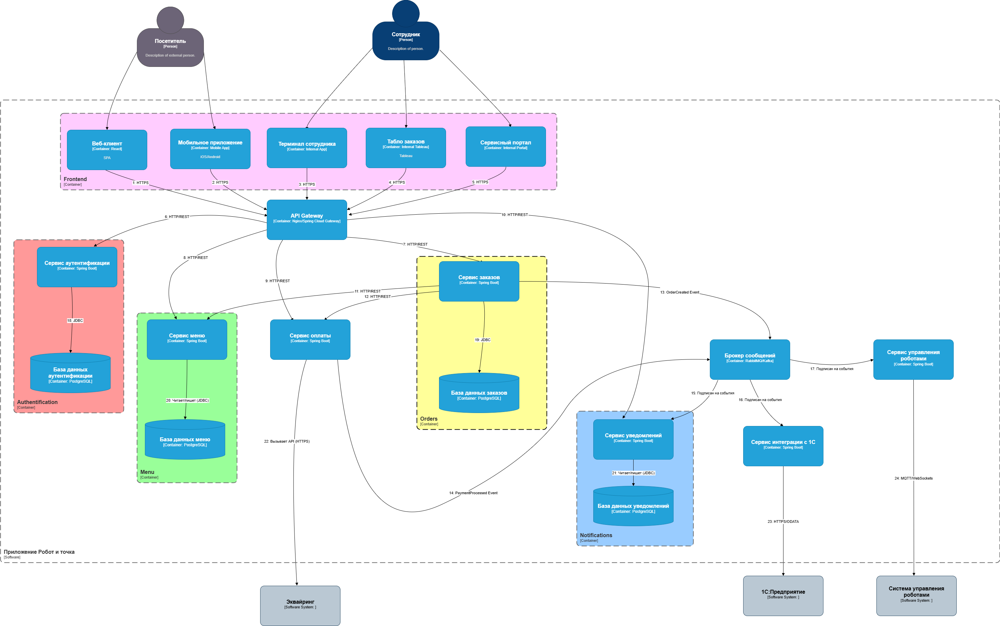

# 8 Компонентная архитектура
## 8.1. Обоснование выбора архитектурного стиля

На основе анализа требований, выявленных в процессе интервью с ключевыми стейкхолдерами (продакт-менеджер, СТО, технолог), можно сделать вывод о том, что наиболее оптимальным выбором архитектуры приложения для заказов и системы оповещения будет микросервисная архитектура. 

Для того, чтобы сделать приложение, соответствующее требованиям к системе, описанным в разделе 6, требуется:

* заменить работу по FTP на современные API-интерфейсы для обеспечения оперативной работы с данными в реальном времени
* снизить влияние слабодкументированных "самописных" систем, - микросервисная архитектура позволит инкапсулировать подобные системы в отдельные сервисы с хорошо задокументированным API
* обеспечить устойчивости к пиковым нагрузкам через горизонталное масштабирование ресурсоемких сервисов (добавление реплик)
* оптимизировать работу приложения, создавая высоконагруженные сервисы, сервисы интеграции и не нагруженные сервисы на различных языках программирования, более подходящих их нагрузке
* повысить отказоустойчивость за счет изолирования проблемного сервиса от остальной системы

Таким образом, выбор микросервисной архитектуры соответствует всем требованиям к системе заказов и оповещения, обеспечит возможность для масштабирования в будущем, гибкость и устойчивость системы на продолжительное время.

## 8.2. Диаграмма компонентов

[{: .hover-zoom }](diagrams/component_diagram.png){: target="_blank" }

## 8.3 Таблица информационных потоков

| № | Источник (Контейнер) | Приемник (Контейнер) | Передаваемая информация / Событие (Сущности) | Протокол / Метод взаимодействия |
|---|----------------------|----------------------|---------------------------------------------|--------------------------------|
| 1 | Веб-клиент | API Gateway | Учетные данные (логин/пароль), Данные для создания заказа (состав, адрес, комментарий), Запросы на получение меню и статуса заказов | HTTPS / REST API |
| 2 | Мобильное приложение | API Gateway | Учетные данные (логин/пароль), Данные для создания заказа (состав, адрес, комментарий), Запросы на получение меню и статуса заказов, Token для Push-уведомлений | HTTPS / REST API |
| 3 | Терминал сотрудника | API Gateway | Команды на изменение статуса заказа, Запросы на обновление меню, Запросы на списки заказов | HTTPS / REST API |
| 4 | Табло заказов | API Gateway | Запросы агрегированных данных для отчетов (метрики по выручке, заказам) | HTTPS / REST API |
| 5 | Сервисный портал | API Gateway | Запросы и данные для управления пользователями, настройками системы, просмотра логов | HTTPS / REST API |
| 6 | API Gateway | Сервис аутентификации | Учетные данные для проверки, JWT-токен для валидации | HTTP / REST API |
| 7 | API Gateway | Сервис заказов | Запрос на создание заказа, Запрос на получение статуса заказа | HTTP / REST API |
| 8 | API Gateway | Сервис меню | Запрос на получение актуального меню | HTTP / REST API |
| 9 | API Gateway | Сервис оплаты | Запрос на инициализацию платежа | HTTP / REST API |
| 10 | API Gateway | Сервис уведомлений | Запросы на управление шаблонами и рассылками | HTTP / REST API |
| 11 | Сервис заказов | Сервис меню | Запрос на валидацию состава заказа | HTTP / REST API (синхронный вызов) |
| 12 | Сервис заказов | Сервис оплаты | Запрос на финальную инициализацию платежа после создания заказа (PaymentOrderRequest: order_id, итоговая сумма) | HTTP / REST API |
| 13 | Сервис заказов | Брокер сообщений (MQ) | Событие OrderCreated (данные заказа: order_id, status, user_id, состав, общая сумма, адрес доставки) | AMQP / Kafka Protocol (JSON) |
| 14 | Сервис оплаты | Брокер сообщений (MQ) | Событие PaymentProcessed (order_id, payment_id, статус оплаты, сумма, timestamp) | AMQP / Kafka Protocol (JSON) |
| 15 | Брокер сообщений (MQ) | Сервис уведомлений | События OrderCreated, PaymentProcessed, другие бизнес-события для триггеров уведомлений | AMQP / Kafka Protocol (JSON) |
| 16 | Брокер сообщений (MQ) | Сервис интеграции с 1C | События OrderCreated (со статусом "Выполнен"), PaymentProcessed (успешные) для синхронизации данных с системой учета | AMQP / Kafka Protocol (JSON) |
| 17 | Брокер сообщений (MQ) | Сервис управления роботами | События OrderCreated (со статусом "В приготовлении"), PaymentProcessed (успешные) для запуска автоматических процессов | AMQP / Kafka Protocol (JSON) |
| 18 | Сервис аутентификации | БД аутентификации | Сущности: User (логин, хэш пароля, роли), Token (JWT-токены) | JDBC |
| 19 | Сервис заказов | БД заказов | Сущности: Order (статус, сумма, клиент), OrderItem (позиция, количество, цена на момент заказа) | JDBC |
| 20 | Сервис меню | БД меню | Сущности: MenuItem (название, описание, цена, категория, наличие), Category | JDBC |
| 21 | Сервис уведомлений | БД уведомлений | Сущности: Notification (получатель, тип, статус, содержимое), Template (шаблоны SMS/email/push) | JDBC |
| 22 | Сервис оплаты | Эквайринг | PaymentRequest (сумма, валюта, описание заказа, токенизированные данные карты или ссылка на платежную форму) | HTTPS / REST API (PSI) |
| 23 | Сервис интеграции с 1C | 1C:Предприятие | Сущности для синхронизации: Финансовые операции (заказы, платежи), Номенклатура (списание ингредиентов) | HTTPS / OData API |
| 24 | Сервис управления роботами | Система управления роботами | RobotCommand (идентификатор робота/линии, действие command, параметры parameters) | MQTT / WebSockets (JSON) |

## 8.4.	Описание компонентов

# 8.4. Описание компонентов системы
## 8.4.1. Граница системы: "Приложение Робот и точка"
Данная граница определяет общие рамки разрабатываемого приложения. 

## 8.4.2. Внешние роли (Actors)

### Посетитель
- **Тип:** Внешний пользователь
- **Назначение:** Взаимодействует с системой через приложение или веб-интерфейс с целью оформления заказов

### Сотрудник
- **Тип:** Внутренний пользователь
- **Назначение:** Персонал ресторана, использующий систему для управления заказами, меню и мониторинга работы

## 8.4.3. Клиентские приложения (Frontend)

### Веб-клиент
- **Тип:** Single-Page Application (SPA)
- **Технология:** React
- **Назначение:** Основной интерфейс для Посетителей
- **Функционал:** Просмотр меню, оформление и отслеживание заказов
- **Взаимодействие:** HTTPS → API Gateway (1)

### Мобильное приложение
- **Тип:** Мобильное приложение
- **Технология:** iOS/Android
- **Назначение:** Аналог Веб-клиента для мобильных устройств
- **Взаимодействие:** HTTPS → API Gateway (2)

### Терминал сотрудника
- **Тип:** Внутреннее приложение
- **Технология:** Internal App
- **Назначение:** Управление заказами в реальном времени
- **Взаимодействие:** HTTPS → API Gateway (3)

### Табло заказов
- **Тип:** Внутреннее табло (Dashboard)
- **Технология:** Internal Tableau
- **Назначение:** Отображение актуальной информации по заказу
- **Взаимодействие:** HTTPS → API Gateway (4)

### Сервисный портал
- **Тип:** Внутренний портал
- **Технология:** Internal Portal
- **Назначение:** Управление меню, аналитика и настройки системы
- **Взаимодействие:** HTTPS → API Gateway (5)

## 8.4.4. Бэкенд-сервисы (Backend Services)

### API Gateway
- **Тип:** Шлюз API
- **Технология:** Nginx / Spring Cloud Gateway
- **Назначение:** Единая точка входа, маршрутизация, аутентификация
- **Взаимодействие:** Принимает запросы 1-5, перенаправляет на сервисы 6-9

### Сервис аутентификации (Authentication)
- **Тип:** Бэкенд-сервис
- **Технология:** Spring Boot
- **Назначение:** Аутентификация и авторизация пользователей
- **Взаимодействие:** Запросы от API Gateway (6), БД аутентификации (18)

### Сервис заказов (Orders)
- **Тип:** Бэкенд-сервис
- **Технология:** Spring Boot
- **Назначение:** Управление жизненным циклом заказов
- **Взаимодействие:** 
  - Запросы от API Gateway (7)
  - Использует Сервис меню (11) и Сервис оплаты (12)
  - БД заказов (19)
  - Публикует события, связанные с заказом (13)

### Сервис меню (Menu)
- **Тип:** Бэкенд-сервис
- **Технология:** Spring Boot
- **Назначение:** Управление данными меню
- **Взаимодействие:** Запросы от API Gateway (8) и Сервиса заказов (11), БД меню (20)

### Сервис оплаты (Payment)
- **Тип:** Бэкенд-сервис
- **Технология:** Spring Boot
- **Назначение:** Обработка платежей
- **Взаимодействие:** 
  - Запросы от Сервиса заказов (12)
  - Интеграция с Эквайринг (22)
  - Публикует события, связанные с платежами (14)

## 8.4.5. Сервисы уведомлений и интеграции

### Брокер сообщений
- **Тип:** Message Broker
- **Технология:** RabbitMQ / Kafka
- **Назначение:** Асинхронное взаимодействие через события
- **Взаимодействие:** Принимает события 13-14, рассылает подписчикам 15-17

### Сервис уведомлений (Notifications)
- **Тип:** Бэкенд-сервис
- **Технология:** Spring Boot
- **Назначение:** Отправка уведомлений пользователям
- **Взаимодействие:** Подписка на события (15), БД уведомлений (21)

### Сервис интеграции с 1С
- **Тип:** Бэкенд-сервис
- **Технология:** Spring Boot
- **Назначение:** Синхронизация данных с 1С
- **Взаимодействие:** Подписка на события (16), HTTPS/ODATA → 1С (23)

### Сервис управления роботами
- **Тип:** Бэкенд-сервис
- **Технология:** Spring Boot
- **Назначение:** Управление автоматизированными системами
- **Взаимодействие:** Подписка на события (17), MQTT/WebSockets → Система управления роботами (24)

## 8.4.6. Базы данных (Data Storage)

### База данных аутентификации
- **Тип:** Реляционная БД
- **Технология:** PostgreSQL
- **Назначение:** Учетные данные пользователей, роли, сессии
- **Использование:** Сервис аутентификации (18)

### База данных заказов
- **Тип:** Реляционная БД
- **Технология:** PostgreSQL
- **Назначение:** Информация о заказах
- **Использование:** Сервис заказов (19)

### База данных меню
- **Тип:** Реляционная БД
- **Технология:** PostgreSQL
- **Назначение:** Данные меню, цены, остатки
- **Использование:** Сервис меню (20)

### База данных уведомлений
- **Тип:** Реляционная БД
- **Технология:** PostgreSQL
- **Назначение:** История и шаблоны уведомлений
- **Использование:** Сервис уведомлений (21)

## 8.4.7. Внешние программные системы

### Эквайринг
- **Тип:** Внешняя система
- **Назначение:** Платежная система
- **Взаимодействие:** Вызов от Сервиса оплаты через HTTPS API (22)

### 1C:Предприятие
- **Тип:** Внешняя ERP-система
- **Назначение:** Корпоративная система учета
- **Взаимодействие:** HTTPS/ODATA через Сервис интеграции (23)

### Система управления роботами
- **Тип:** Внешняя система
- **Назначение:** Управление аппаратным обеспечением
- **Взаимодействие:** MQTT/WebSockets через Сервис управления роботами (24)