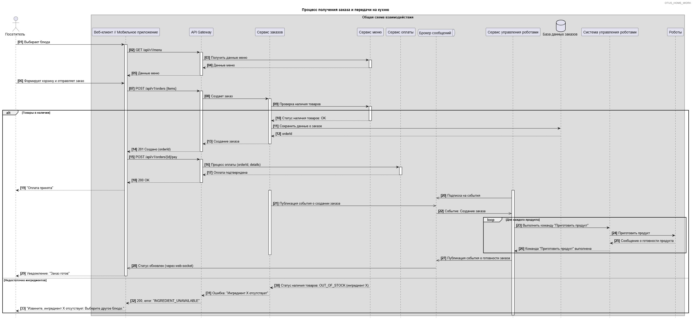

# 9	Интеграционное взаимодействие
Система реализует микросервисную архитектуру разделением ответственности между компонентами. Интеграционное взаимодействие строится на основе REST API для синхронных операций и брокера сообщений для асинхронной обработки событий.
## 9.1	Диаграмма последовательности

[{: .hover-zoom }](diagrams/sequence_diagram.jpg){: target="_blank" }

## 9.2 Ключевые интеграционные точки

### 9.2.1 Интеграция с роботизированным производством Australian Robots

**Назначение**: Передача заказов на приготовление и мониторинг статусов выполнения

**Протокол**: REST API с аутентификацией по API Key

**Эндпоинт**: `POST /api/v1/production/orders`

**Формат данных**: JSON с указанием состава заказа и параметров приготовления

**Таймаут**: 5 секунд

**Повторные попытки**: 3 раза с экспоненциальной задержкой

### 9.2.2 Интеграция с платежными системами
**Назначение:** Обработка онлайн-платежей банковскими картами

**Протокол:** REST API через шлюз 

**Эндпоинт:** POST /api/v1/payments/process

**Безопасность:** TLS 1.3, токенизация данных карт

### 9.2.3 Интеграция с системой 1С:Бухгалтерия
**Назначение:** Синхронизация данных о продажах и движении товаров

**Протокол:** OData API (REST)

**Периодичность:** Ежечасная выгрузка

**Данные:** Заказы, платежи, списание ингредиентов

### 9.2.4 Интеграция с системой складского учета
**Назначение:** Мониторинг остатков ингредиентов и полуфабрикатов

**Протокол:** REST API с веб-хуками

**Режим:** Обновления в реальном времени при изменениях

**Данные:** Остатки, сроки годности, поступления

### 9.3 Протоколы и стандарты

#### 9.3.1 Форматы данных

**JSON:** Основной формат для REST API

**XML:** Для интеграции с системами производства (технологические карты)

**Protobuf:** Для высоконагруженных внутренних коммуникаций

#### 9.3.2 Безопасность

**Аутентификация:** JWT tokens + API Keys

**Авторизация:** RBAC на уровне endpoints

**Шифрование:** TLS 1.3 для всех внешних соединений

**Сертификаты:** Let's Encrypt для публичных API
