# 5 Описание бизнес-процессов¶
## 5.1 Взаимодействие клиента с системой¶

&nbsp;&nbsp;&nbsp;&nbsp; На схеме представлен следующий бизнес-процесс:

&nbsp;&nbsp;&nbsp;&nbsp; Оформление заказа через приложение

[{: .zoomable }](diagrams/making_order.png){: target="_blank" }

